# Finch Architecture

## 1. What Finch is

Finch is a vector database that runs inside your process. There is no server. A collection is
one directory on disk. It holds documents, and each document has a primary key, scalar fields,
and dense or sparse vector fields. A collection answers vector queries, SQL-like filters, and
`SELECT` statements. The memory layer for agents sits on top of the database and stores its data
in ordinary collections.

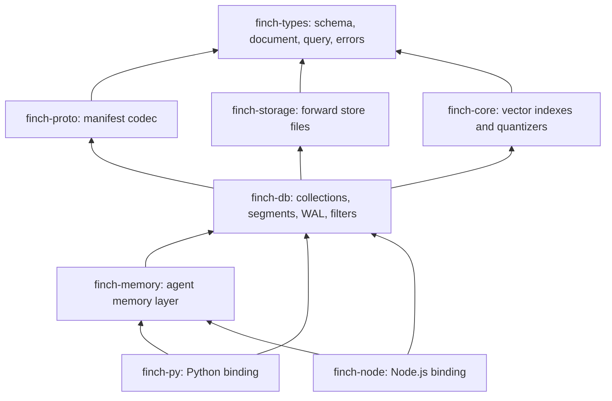

An arrow points from a crate to a crate it depends on.

## 2. A collection on disk

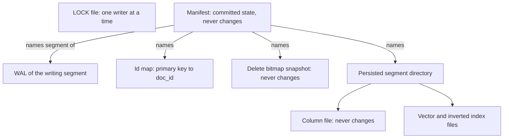

The manifest is the committed state of a collection. It names the schema, the persisted
segments, the writing segment, the id map, and the delete bitmap. Open ignores every file that
the manifest does not name.

Every document gets a `doc_id`, an internal number. Each insert, upsert, or update gives the
document a new `doc_id`. The id map points each primary key at its current `doc_id`. The delete
bitmap is the set of `doc_id`s that a delete or a replacement retired. Each flush writes the id
map to a sorted checkpoint file that the manifest names. A read-write open rebuilds its working
copy of the id map from that file and the WAL; a read-only open reads the file directly.

A segment is a group of documents. The writing segment holds new documents in memory, and the
WAL (write-ahead log) records each change to it. A flush turns the writing segment into a
persisted segment. After Finch writes a manifest, a delete bitmap snapshot, an id map checkpoint,
or the column file or inverted index file of a segment, it never changes that file. A newer file
replaces it.

## 3. The write path

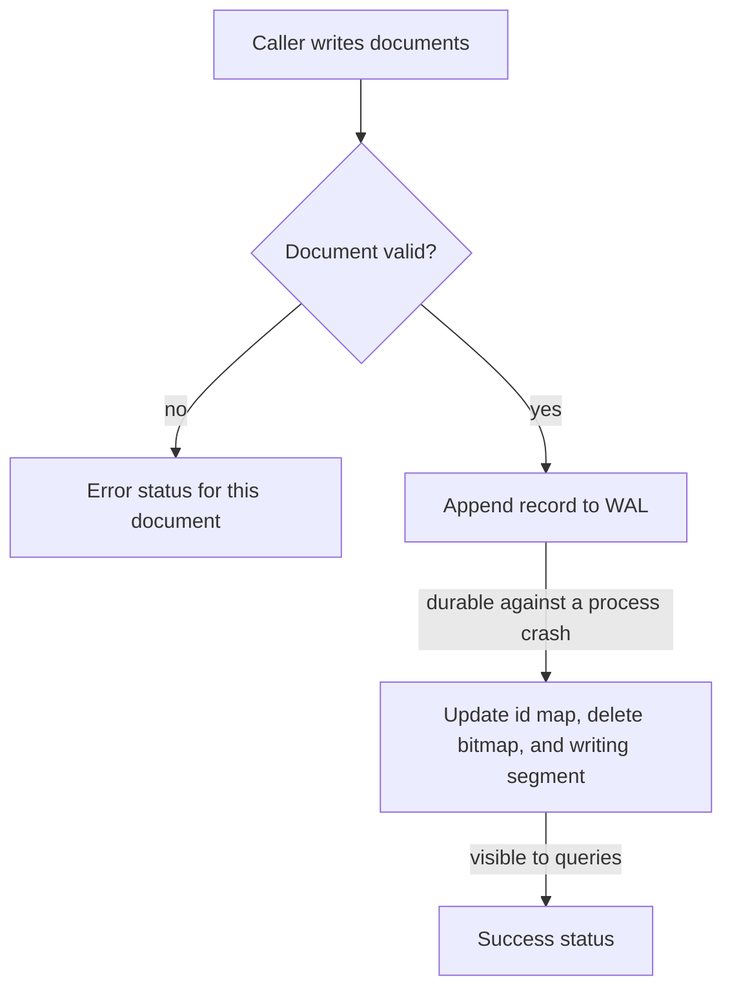

Finch appends each write to the WAL before it changes any state. From that point, a process
crash cannot lose the write, because open replays the WAL. Then Finch points the primary key at
the new `doc_id`, retires the old one, and adds the document to the writing segment.

## 4. Flush

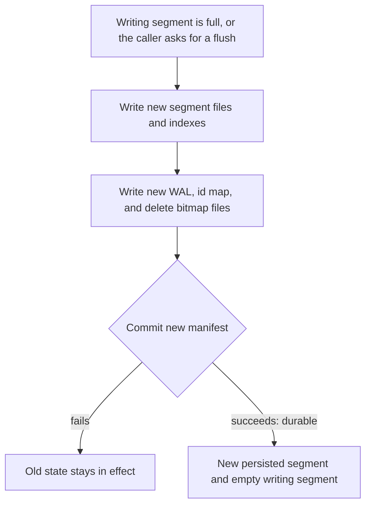

A flush writes every new file, then commits a new manifest. The flush becomes durable only at
that commit. Queries see the flushed documents the whole time, first in the writing segment and
then in the new persisted segment.

## 5. The read path

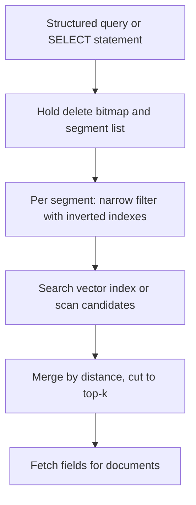

A query holds the delete bitmap and the segment list until its scan ends. A concurrent flush or
upsert therefore cannot hide a document from it. Each segment uses its inverted indexes to find
candidate documents, then searches its vector index or computes exact distances for a small set.
Finch merges the results of all segments by distance, skips deleted documents, and fetches the
requested fields.

## 6. Crash recovery

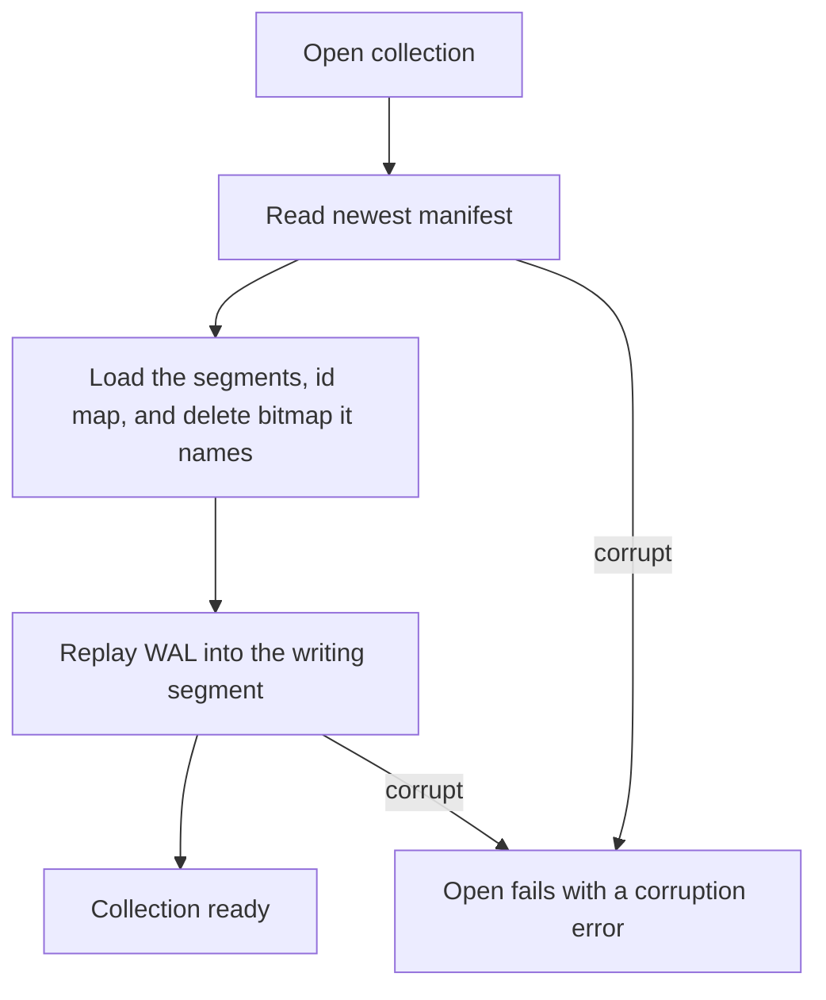

Open reads the newest manifest and loads the files it names. Then it replays the WAL, which
restores every write since the last flush. A crash can tear only the last WAL record, and replay
stops quietly at it. Any other damage to the WAL or the manifest makes open fail.

## 7. Compaction

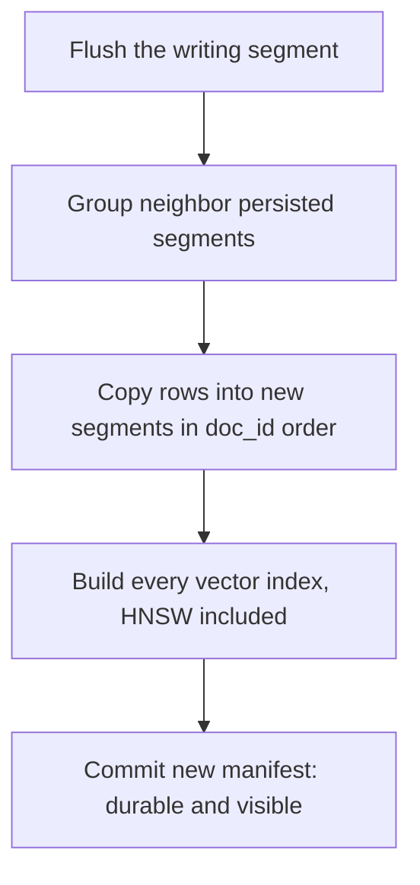

Compaction merges persisted segments into new ones and builds every missing vector index. Rows
keep their `doc_id`s. When deleted rows make up more than 30 percent of the persisted rows,
compaction drops them. Otherwise the delete bitmap keeps hiding them.

## 8. What the memory layer stores

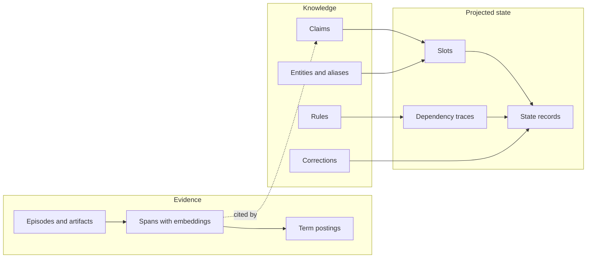

The memory layer is a set of collections in one directory. Each record kind has its own
collection. A memory store therefore gets the write path, the read path, and the crash
recovery of the sections above without change.

Evidence is what happened. An episode is one event, such as a user message or a tool result. An
artifact is a file, a page, or a document. Finch splits their text into overlapping spans. Each
span holds its text, a caller-supplied embedding under an HNSW index, and a row of term counts
for keyword search.

Knowledge is what the caller says the evidence means. A claim names a subject, a predicate, and a
value, and cites the spans it came from. "The user lives in Denver" has subject "user", predicate
"lives in", and value "Denver". A correction changes the standing of a claim. A rule links two
slots, so a change in one can change the other. An entity is a person, place, or thing with a
canonical name and aliases.

Projected state is what Finch computes from knowledge. A slot is one subject and predicate pair.
A state record is one version of what a slot held, with the claims, corrections, and rules that
produced it. A dependency trace records which rule derived a state record from which claim.

Every record carries a scope: a space, and optional tenant, user, agent, project, and thread ids.
Every read and write filters on the scope, so one store can hold many users. A read at a scope
also returns the records of narrower scopes. A write changes records of its own scope only.

## 9. Ingest

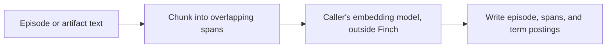

Finch cuts the text into spans of a fixed number of characters with an overlap. A sentence
that straddles a cut therefore appears whole in one of the two spans. The caller embeds each span. Finch
writes the episode, the spans with their vectors, and one term posting per distinct word in
each span. Ingest writes no claims. The caller runs its own extractor over the spans and writes
the claims it finds.

## 10. Claims and state

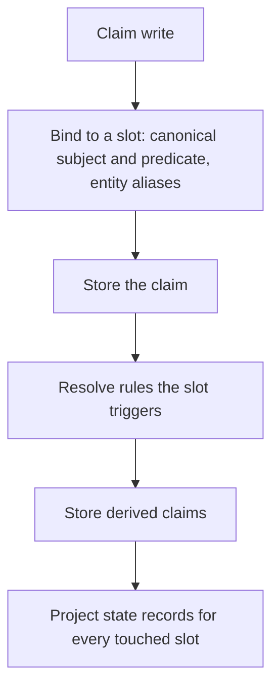

A claim write binds the claim to a slot. Finch normalizes the subject and the predicate into
keys, and an alias table maps a subject such as "my brother" to the entity it names. Then Finch
stores the claim and runs the rules that the slot triggers. It stores the claims those rules
derive and projects new state records for every slot the write touched. The write returns after the
projection, so the next read sees the new state.

A state record has two timelines. Valid time says when the fact held in the world. Transaction
time says when Finch recorded and superseded the record. Say the user moved to Denver in March and
said so in May. Then the valid time starts in March and the transaction time starts in May. A read
can ask for the current state, for the state at a valid time, or for what Finch knew at a
transaction time.

A newer claim on the same slot supersedes the older one. Both stay stored, and the older one
keeps its valid interval. State records have six kinds: current, set, tombstone, unsupported,
derived, and rule. A set record holds every member of a set-valued slot, such as the user's
allergies. A tombstone says the slot held nothing from a given time. An unsupported record says
the old value no longer has evidence behind it.

Version ids hash the batch that wrote them, not the clock. Replaying the same writes yields the
same ids and the same state.

## 11. Rules

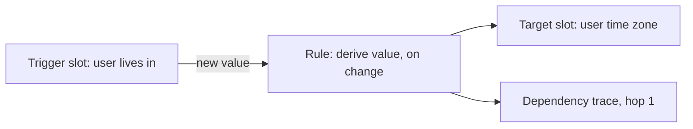

A rule links a trigger slot to a target slot. When the trigger changes, the rule either derives a
new value for the target from a template, or marks the target unsupported. For example, a rule
can say that a change of the user's city makes the user's stored commute time unsupported. A rule
fires on change, or on every projection when the caller asks for that. Derived claims can
trigger further rules up to a fixed number of hops, and each hop writes a dependency trace. A
read follows the traces back to the claim that started the chain.

## 12. Corrections and forgetting

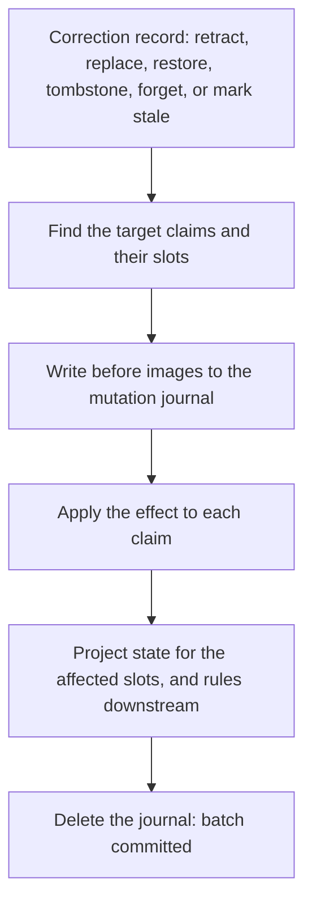

Finch never edits a stored claim in place. A correction is its own record. It names its target
by claim ids or by slot. It carries the time it takes effect and who asked for it. A retract
ends the claim's validity at that time. A replace also writes a new claim with the new value. A
restore brings a retracted claim back. A forget ends the claim in every current read and packs
it as a tombstone. The stored row stays. Any rule that depends on the affected slot fires again,
so a derived value falls with its source.

Every state write changes several collections: the batch write API, and the single writes of a
claim, correction, rule, entity, or slot alias, and the scope rebuild. Each one takes the store's
write lock and opens a journal file in the store directory. Before it changes a record, Finch
appends that record's prior version to the journal as one checksummed entry and fsyncs it. A
write that changes many records adds one short entry per change and never rewrites the file.
When the write completes, Finch deletes the journal; when it fails, Finch restores every prior
version first. If that restore also fails, some of the failed write may still be visible, so
the store refuses every later read and write with an error that says to reopen it. If the
process dies in between, the next open reads the journal up to its last whole entry, restores
every prior version, and deletes it. It skips an entry the crash cut short, because Finch had not
yet changed the record that entry names. A read therefore sees the whole write or none of it. A
write to a state collection with no journal open is an error.

The journal makes a write whole or absent across a process crash. Across a power loss or an
operating system crash it holds only as far as the collections' WALs reach the disk, and that
depends on the global setting `wal_fsync_every_docs`, which by default never fsyncs. With the
default, a power loss can lose part of a finished write or part of a restore, even though the
journal itself was on disk.

## 13. The memory read path

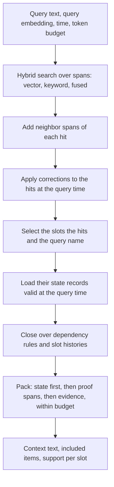

A read searches the spans two ways. The vector index finds spans near the query embedding, and
the term postings rank spans by keyword match. Finch fuses the two rankings by reciprocal rank
and keeps hits from many sources rather than one. It adds the spans next to each hit, so a
cut sentence reads whole.

The hits and the query name a set of slots. Finch loads the state records of those slots that
were valid at the query time. It adds every slot a dependency rule links them to and loads
the history of each slot. The result is a projection: claims, set states, tombstones, rule outcomes,
corrections, and the spans that prove them.

The packer fills the token budget in a fixed order. State comes first: the slots the query asks
about, then entity cards, then other claims, sets, corrections, and rules. Then the spans that
prove that state, then the other evidence spans, then slot histories, then profiles and
artifacts. The output is the context text, the list of included items, and a support flag per
slot. The flag says whether the packed context has evidence for that slot, has none, or holds a
tombstone. With the same records and the same hits, the packer writes the same context.

## 14. Guarantees

- Open sees the old manifest or the new one, never a mix.
- A flush, a compaction, a column change, and an index change each take effect at one manifest
  commit.
- A query sees an upsert or an update as one step: the old version or the new one, never both.
- Each document in a batch write succeeds or fails alone.
- A process crash does not lose an acknowledged write.
- By default, an operating system crash or power loss can lose recent writes. The global
  setting `wal_fsync_every_docs` makes Finch fsync the WAL every N records; its default, 0,
  never fsyncs.
- A delete is in the WAL before it returns and commits a new manifest. If that commit fails,
  the delete still stands, and the next delete or flush retries the commit.
- A filter matches the same documents with or without an inverted index.
- A filter condition on a missing field does not match.
- With the same records and search hits, the memory layer packs the same context.
- One process at a time can open a collection for writing.
- Every read and write of the memory layer stays inside its scope.
- A memory-layer write takes effect as one batch, or not at all, across a process crash.
  Across a power loss this holds only as far as the WAL fsync setting reaches, which by default
  is not at all.
- If a failed memory-layer write cannot be rolled back, the store refuses every read and write
  until it is reopened, and the reopen rolls it back.
- A claim, a correction, and a rule never change after Finch stores them. A new record
  supersedes an old one.
- A read at a past valid time or a past transaction time returns the versions that held then.
- The same writes in the same order produce the same version ids.

## Where to look

| Concept | Path |
|---|---|
| Workspace crates | `Cargo.toml` |
| Public collection API | `crates/finch-db/src/collection.rs` |
| Write, flush, query, open, compaction | `crates/finch-db/src/collection` |
| On-disk file names and the lock | `crates/finch-db/src/collection_files.rs` |
| Manifest | `crates/finch-db/src/version.rs` |
| WAL | `crates/finch-db/src/wal.rs` |
| Filter evaluation | `crates/finch-db/src/sqlengine` |
| Vector index algorithms | `crates/finch-core/src/algorithm` |
| Global config, including WAL fsync | `docs/global-config.md` |
| Memory collections and their fields | `crates/finch-memory/src/schema.rs` |
| Chunking and ingest | `crates/finch-memory/src/ingest.rs` |
| Hybrid span search | `crates/finch-memory/src/store/search.rs` |
| Claim binding and state projection | `crates/finch-memory/src/store/state_records.rs` |
| Rules and dependency traces | `crates/finch-memory/src/store/rules.rs` |
| Corrections and claim lifecycle | `crates/finch-memory/src/store/lifecycle.rs` |
| Mutation journal | `crates/finch-memory/src/store/mutation_journal.rs` |
| Answer-ready read | `crates/finch-memory/src/store/projection.rs` |
| Context packing | `crates/finch-memory/src/context.rs` |
